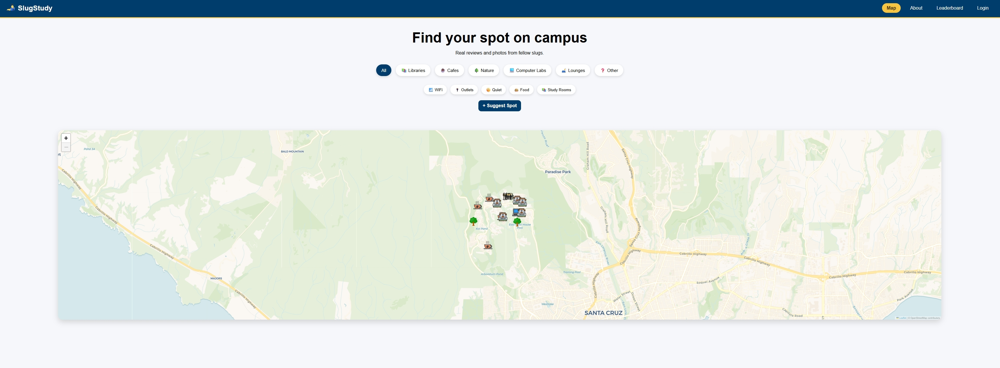

# 🐌 SlugStudy

**Find your spot on campus.** A crowdsourced map of study spots around UC Santa Cruz — built for students, by a student.

🔗 **Live site:** [slugstudy.pythonanywhere.com](https://slugstudy.pythonanywhere.com/)



## Why I built this

UCSC has a ton of great study spots that never show up on any official campus map — quiet corners, hidden outdoor nooks, half-empty computer labs. I kept hearing "wait, there's a spot like that?" from people who'd been here for years, so I built a place for students to actually document and share them.

## Features

- 🗺️ **Interactive map** — browse study spots by category (libraries, cafes, outdoor, computer labs, lounges, and more)
- ⭐ **Reviews & ratings** — leave and edit reviews, with average ratings calculated live
- 👍 **Likes** — quick way to upvote favorite spots
- 📷 **Photo submissions** — users can submit photos of a spot, reviewed before going live
- ➕ **Spot submissions** — anyone can suggest a new spot with location, tags, and description
- 🛡️ **Moderation queue** — an admin review flow so new spots/photos are approved before appearing publicly
- 🏆 **Gamification** — a points system, unlockable badges, and a leaderboard to encourage contributions
- 🔒 **Account security** — hashed passwords, CSRF protection, rate limiting, profanity filtering on usernames/reviews

## Screenshots


## Tech stack

**Backend:** Python, Flask, SQLite
**Auth & security:** Flask-Login, Flask-WTF (CSRF), Flask-Limiter (rate limiting), Werkzeug (password hashing)
**Frontend:** Vanilla JavaScript, HTML, CSS (no framework)
**Deployment:** PythonAnywhere

## What I learned

- **Designing a relational schema from scratch** — modeling spots, users, reviews, likes, badges, and a separate "pending" table for moderation taught me a lot about normalizing data and thinking through foreign key relationships before writing a single route.
- **Auth and security aren't an afterthought** — adding CSRF protection, rate limiting, and password hashing after the fact showed me why it's better to think about abuse cases (spam accounts, bot submissions, profanity) from the start.
- **Building without a frontend framework** — writing the interactive map and modals in vanilla JS forced me to actually understand DOM manipulation and event handling instead of leaning on abstractions.
- **Moderation matters for any user-generated content platform** — I originally didn't plan for an approval queue, but realized quickly that letting anything post live instantly would make the map unusable within days and users could potentially suggest random spots to troll.
- **Shipping beats perfecting** — this is a solo project built around a real problem I had, and getting it deployed and usable mattered more than making every feature perfect first.

## Running locally

```bash
git clone https://github.com/alexus-Huang/SlugStudySpots.git
cd SlugStudySpots
pip install -r requirements.txt
python app.py
```

You'll need a `.env` file with a `SECRET_KEY` set.

## Contributing / feedback

Found a bug or have an idea? There's a feedback form built right into the site, or feel free to open an issue on GitHub.